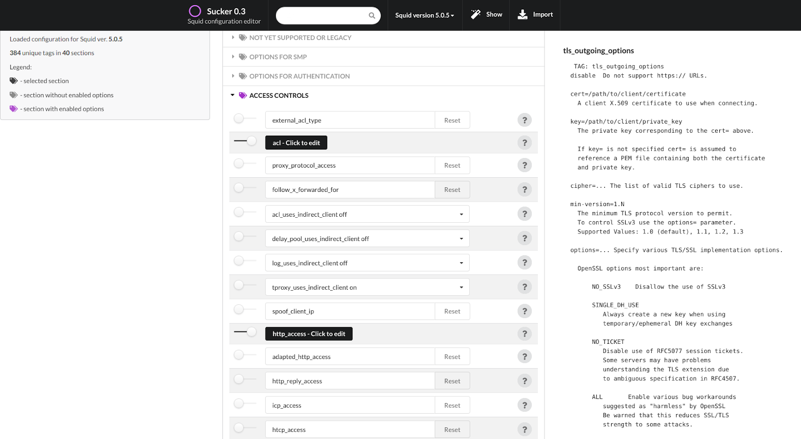

# Sucker

Editor for Squid proxy configuration files based on default squid.conf.
##To install:

### as local docker container

Pull from :

```s
docker pull itworks99/sucker
```

to start:

```s
docker run -d -p 8080:8080 itworks99/sucker
```

### on a local system

To prepare (tested on debian):

```shell
sudo apt-get install git python3 python3-pip -y
https://github.com/itworks99/sucker.git
cd sucker
pip3 install -r requirements.txt
```

to start:

```shell
python3 src/sucker.py
```

## To run

Navigate to http://localhost:8080/

## Screenshots


